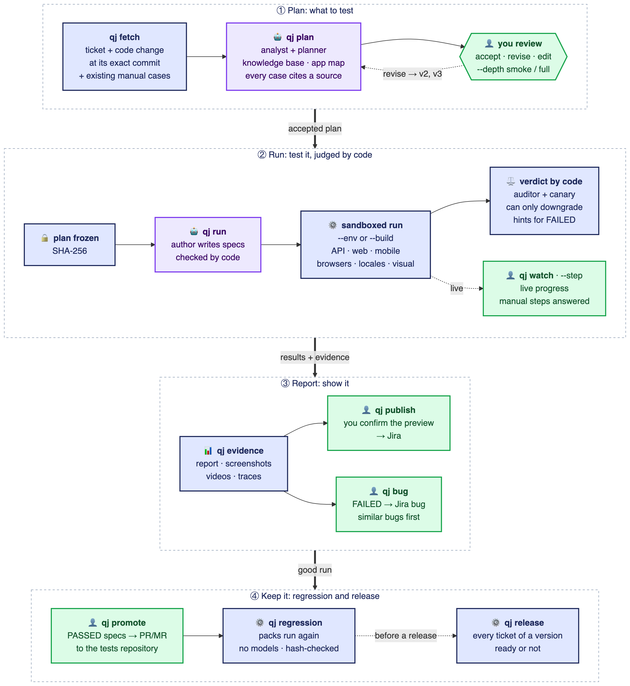

<p align="center">
  
</p>

<h3 align="center">The Ancient Art of Agentic QA</h3>

<p align="center">
  <em>AI that tests your tickets, and cannot lie about the result.</em><br>
  Jira ticket in → a test plan you approve → API, web and mobile tests → evidence and a verified result back in Jira.
</p>

<p align="center">
  <a href="#2-installation-and-first-setup">Install</a> ·
  <a href="#3-the-flow-step-by-step">The flow</a> ·
  <a href="#4-command-reference">Commands</a> ·
  <a href="#10-try-it-on-the-demo-shop">Try the demo</a> ·
  <a href="docs/guides/ci-cd.md">CI/CD</a>
</p>

<p align="center">
  
  
  
  
</p>

---

**Give QAJitsu a Jira ticket.** It reads the ticket and the code that changed (GitHub, GitLab or a local repository),
proposes a test plan for you to approve, runs API, web and mobile tests, collects evidence (requests and responses,
screenshots, videos, logs) and posts a computed test matrix back to Jira.

|                                | Why it is different                                                                                                                 |
| ------------------------------ | ----------------------------------------------------------------------------------------------------------------------------------- |
| 🥋 **AI plans, code judges**   | Agents analyse the change and write the tests; a deterministic runner decides PASSED or FAILED. No model can mark a test as passed. |
| ✅ **You stay in charge**      | Nothing runs before you approve the plan, and nothing reaches Jira before you see the preview.                                      |
| 🔍 **Evidence for every step** | Requests and responses, screenshots, videos, traces and logs, hashed in a manifest and linked from the report.                      |
| 🐞 **Proven on seeded bugs**   | A demo shop with eight hidden bugs: each one must end FAILED, and PASSED without it.                                                |

```sh
qj fetch SHOP-482          # ticket + the code change, at its exact commit
qj plan SHOP-482           # agents write a plan with a source for every case; you accept it
qj run SHOP-482 --build    # tests run against the app built from that commit
qj publish SHOP-482        # after your preview: the matrix and evidence go to Jira
```

> Status: all ten roadmap stages are implemented ([docs/STATUS.md](docs/STATUS.md)).

The one idea behind everything: **agents plan and write tests; deterministic code executes and judges.** An AI model
never decides whether a test passed. A FAILED test stays FAILED, missing evidence is never PASSED, and the extra
checks (auditor, canary) can only make a result worse, never better.

---

## Contents

1. [How it works](#1-how-it-works)
2. [Installation and first setup](#2-installation-and-first-setup)
3. [The flow, step by step](#3-the-flow-step-by-step)
4. [Command reference](#4-command-reference)
5. [Statuses and exit codes](#5-statuses-and-exit-codes)
6. [What QAJitsu writes to disk](#6-what-qajitsu-writes-to-disk)
7. [Configuration (`.qa/`)](#7-configuration-qa)
8. [Additional features](#8-additional-features)
9. [Why you can trust the results](#9-why-you-can-trust-the-results)
10. [Try it on the demo shop](#10-try-it-on-the-demo-shop)
11. [Tuning and extending](#11-tuning-and-extending)
12. [For contributors](#12-for-contributors)

---

## 1. How it works

<p align="center">
  
</p>

<sub>Diagram source: <a href="docs/assets/qajitsu-flow.mmd">docs/assets/qajitsu-flow.mmd</a>, re-render with <code>node scripts/render-diagrams.mjs</code>.</sub>

<p align="center"><sub>🟩 you decide &nbsp;·&nbsp; 🟪 AI agents propose &nbsp;·&nbsp; 🟦 deterministic code executes and judges</sub></p>

| Step                  | Who                         | What it produces                                      | Where it lives (in the run folder)    |
| --------------------- | --------------------------- | ----------------------------------------------------- | ------------------------------------- |
| `qj fetch`            | code                        | the ticket, the change, worktrees at its commit       | `ticket/`, `repos/`                   |
| `qj plan`             | AI agents                   | analysis and plan versions with sources               | `analysis.json`, `plan/plan.vN.yaml`  |
| review / `qj approve` | **you**                     | the frozen plan and its SHA-256                       | `plan/plan.approved.yaml`, `run.json` |
| `qj run` (author)     | AI agent                    | one spec per case, checked by code                    | `specs/`                              |
| `qj run` (execution)  | code                        | assertions, evidence with hashes                      | `results/`, `evidence/`               |
| `qj run` (verdict)    | code                        | statuses, gates, auditor and canary records, reports  | `checks/`, `report/`                  |
| `qj evidence`         | you                         | the report, failed steps, screenshots, videos, traces | `report/report.html`                  |
| `qj publish`          | **you** confirm, code posts | the Jira comment and the evidence zip                 | Jira ticket                           |

Every ticket gets a **run folder** in its project (`~/.qajitsu/projects/<project>/runs/<TICKET>/<RUN-ID>/`). Each command continues the latest run of the
ticket unless you pass `--run <id>`. A new `qj fetch` starts a new run.

---

## 2. Installation and first setup

### Requirements

| Needed for | What                                                                                                                                    |
| ---------- | --------------------------------------------------------------------------------------------------------------------------------------- |
| everything | Node.js 22.12 or newer, git, pnpm (`corepack enable`)                                                                                   |
| web tests  | Chromium for Playwright: `pnpm --filter @qajitsu/cli exec playwright-core install chromium`                                             |
| `--build`  | Docker with Compose v2 (for `kind: compose` services); not needed for `kind: process`                                                   |
| Android    | JDK 17, Android SDK (emulator, platform 34, build-tools 34, a system image), Appium: see [docs/guides/mobile.md](docs/guides/mobile.md) |
| models     | an API key of a provider (Anthropic, OpenAI, Google, any OpenAI-compatible gateway) or a local model via Ollama                         |

Linux and macOS are supported (CI runs on both). Windows: use WSL 2.

### Build and put `qj` on the PATH

```sh
git clone <this repository> qajitsu && cd qajitsu
pnpm install
pnpm build
alias qj="node $PWD/packages/cli/dist/bin.js"      # or: cd packages/cli && pnpm link --global
qj --version
```

`qajitsu` and `qj` are the same command. Inside this repository `pnpm qajitsu <command>` works too. For CI there is
a Docker image (`ci/docker/Dockerfile`) with Node.js, git, Chromium and `qajitsu` inside.

### Onboard your project

Run these in **your** repository (the one with the application or its tests):

```sh
qj init shop           # registers project "shop" in ~/.qajitsu and creates .qa/ (asks for Jira; detects git host,
                       # docker-compose, OpenAPI, test types); the project becomes the active one
# put the secrets into .env.local next to .qa/ (never commit it):
#   JIRA_EMAIL=...  JIRA_TOKEN=...  GITHUB_TOKEN=...  ANTHROPIC_API_KEY=...
qj doctor --online     # checks Node, config, secrets, Docker, mobile tooling, Jira and code host access
qj doctor --models     # optional: one real call per configured model role
```

Secrets are never written into `.qa/`: the configuration holds references like `secret://env/JIRA_TOKEN`, resolved
from the environment or `.env.local` and masked everywhere (logs, evidence, reports, Jira). Teams with a secret
manager add it under `secrets:` in `qa.project.yaml` and reference values directly:

| Provider              | Configuration (`secrets:`)                                               | Reference                               |
| --------------------- | ------------------------------------------------------------------------ | --------------------------------------- |
| HashiCorp Vault KV v2 | `vault: { address, mount, namespace?, token: secret://env/VAULT_TOKEN }` | `secret://vault/<path>#<field>`         |
| Doppler               | `doppler: { project, config, token: secret://env/DOPPLER_TOKEN }`        | `secret://doppler/<NAME>`               |
| 1Password (`op` CLI)  | `op: {}`                                                                 | `secret://op/<vault>/<item>/<field>`    |
| AWS Secrets Manager   | `aws: { region, profile? }` (AWS CLI and its usual credentials)          | `secret://aws/<secret-id>[#<json-key>]` |
| Google Secret Manager | `gcp: { project }` (`gcloud` and its login)                              | `secret://gcp/<name>[@<version>]`       |

A secret manager's own token always comes from `secret://env/...`; CLIs run with argument arrays and only their own
environment variables.

---

## 3. The flow, step by step

### Step 1: fetch the ticket and the change

```sh
qj fetch SHOP-482
```

**When:** whenever you start testing a ticket, and again when the code changed (a new run starts).
**What it does:** downloads the ticket (summary, description, acceptance criteria, comments), finds the linked PRs/MRs
(Jira development panel, ticket key in branch names or titles), stores their diffs and review comments, and checks
out every repository **at the exact commit of the change** into the run folder. If nothing is linked, pass the
change yourself: `--pr <GitHub URL>`, `--mr <GitLab URL>` or `--ref <repo>=<branch|tag|sha>`.

### Step 2: plan and review

```sh
qj plan SHOP-482
```

**When:** after `fetch`.
**What it does:** the **analyst** classifies the change (api, web, mobile) and lists endpoints, screens and risks; the
**planner** writes the plan: cases (`TC-01`...), steps (`S1`...), exact expected results (HTTP status, response fields,
visible texts, element states), test data as aliases (`user:standard`), open questions. Every case must cite a
source (an acceptance criterion, a quote from the ticket, changed diff lines or a review comment); code rejects
invented sources and the planner has to fix them.

In a terminal you then review it: `[a]ccept`, `[r]evise` (type what should change, a new version is written),
`[e]dit` (open the draft in `$EDITOR`) or `[q]uit`. Without a terminal (CI) the plan is written and the command ends;
use `qj plan SHOP-482 --revise "add a case for expired discount codes"` for a new version.

### Step 3: approve

Accepting in the review approves it. Non-interactively:

```sh
qj approve SHOP-482                          # latest version
qj approve SHOP-482 --version 2              # exactly the version you reviewed
qj approve SHOP-482 --confirm-open-questions # if the plan still has open questions
```

**What it does:** checks the sources again and freezes the plan: `plan/plan.approved.yaml` plus its SHA-256 in
`run.json`. From now on only approved cases run, and a changed approved file blocks the run.

### Step 4: run the tests

```sh
qj run SHOP-482 --env staging                         # an environment that is already deployed
qj run SHOP-482 --build                               # start the app from the fetched code (Docker / processes)
qj run SHOP-482 --build --set api.FEATURE_X=1         # with an overridable variable changed for this run
```

**When:** after approval; for every new environment or build.
**What it does:**

1. Checks the environment (health, allowlist, production ban, the deployed version vs the analysed commit).
2. The **author** agent writes one spec per case (`specs/TC-01.spec.ts`) using the steps API; static checks reject
   specs that do not verify every planned expectation or use forbidden code. A case without a valid spec is BLOCKED.
3. Each spec runs in a **sandbox** (no network, no files, no secrets). The trusted parent process performs every API
   call, drives the browser (Playwright) or the mobile app (Appium), records evidence and compares actual values with
   the approved plan.
4. Failed web steps get up to two **healing** attempts (selectors and waits only; a healed pass is NEEDS_REVIEW).
5. Statuses are computed by code; then the **auditor** and the optional **canary** may downgrade PASSED to NEEDS_REVIEW.
6. Reports are written: `report.html`, `matrix.md/.csv/.xlsx`, `junit.xml`, `gates.json`, the transition graph.

The matrix is printed at the end; the exit code tells the result (section 5).

### Step 5: look at the results

```sh
qj evidence SHOP-482              # opens report.html
qj evidence SHOP-482 --failed     # failed cases: expected vs actual, evidence files, cURL to reproduce
qj evidence SHOP-482 --trace TC-02  # Playwright Trace Viewer of a web case
qj logs SHOP-482 --case TC-02     # what happened, in order (agents, runner, guard decisions)
```

### Step 6: publish to Jira

```sh
qj publish SHOP-482
```

**What it does:** recomputes everything from the files and checks the publish gates (evidence intact, no secrets,
journal intact, approved plan unchanged, ...). Then it shows a **preview** of the Jira comment and asks
`Publish this to SHOP-482? [y/N]`. On `y` it posts the matrix with failures and reproduction hints, attaches the
evidence zip and media; running it again updates the same comment.

### Step 7: clean up

Cleanup follows `cleanup.policy` automatically after `run --build`. Manually: `qj clean SHOP-482` (containers,
worktrees, `.env` files; results and reports stay) and `qj gc` (deletes old runs by retention).

### The short version

```sh
qj fetch SHOP-482 && qj plan SHOP-482     # review: a
qj run SHOP-482 --env staging
qj evidence SHOP-482 --failed
qj publish SHOP-482
```

In Claude Code the same flow is available as `/qa-plan`, `/qa-run` and `/qa-evidence` (section 8).

---

## 4. Command reference

Options common to most ticket commands: `--run <id>` picks a run (default: the latest run of the ticket).
Every option and exit code of every command: [docs/cli/commands.md](docs/cli/commands.md).

### Setup

| Command                                                                        | When to use it                                     | What it does                                                                                                                                                                                                                                                                                                              |
| ------------------------------------------------------------------------------ | -------------------------------------------------- | ------------------------------------------------------------------------------------------------------------------------------------------------------------------------------------------------------------------------------------------------------------------------------------------------------------------------- |
| `qj init <slug> [--qa-dir <path>] [--jira-prefix <KEY>]... [--yes] [--no-use]` | once per project                                   | Registers the project in `~/.qajitsu/projects/<slug>/` (runs, git cache, knowledge, exports) and links its `.qa/` folder, or creates `.qa/` by detection (git host, compose services and ports, OpenAPI, test types). Validates it, lists every problem and makes it the active project.                                  |
| `qj use <slug>` / `qj projects list` / `qj projects current`                   | switching between projects                         | Sets the active project and shows its open work; lists every project with readiness and ticket prefixes; prints the active one. Any command takes `--project <slug>`; a ticket key like `BANK-12` selects its project by prefix.                                                                                          |
| `qj doctor [--online] [--models]`                                              | after setup and whenever something fails           | Checks Node.js, the configuration, every `secret://` reference (by name only), Docker (for `--build`), Android SDK and Appium (for mobile), iOS availability. `--online`: real access checks against Jira and every code host. `--models`: one call per model role and its capabilities. Exit 3 when anything is missing. |
| `qj env check [--env <profile>]`                                               | before the first `--build`                         | Lists every missing or invalid variable of the environment profile and of the `--build` services (secrets, templates, stub mappings, seed hook, compose file) without starting anything.                                                                                                                                  |
| `qj env render <TICKET>`                                                       | debugging a build                                  | Recreates the per-service `.env` files (0600) of a run with the ports recorded by `--build`. They contain secrets; `qj clean` removes them.                                                                                                                                                                               |
| `qj env up <TICKET> [--set <svc.VAR=value>]... [--detach]`                     | checking that the app starts, or poking it by hand | Starts the app from the run's worktree exactly as `run --build` would, without agents or tests, and prints the service URLs. Ctrl+C stops it; `--detach` leaves containers running until `qj clean`.                                                                                                                      |

### Main flow

| Command                                                                                                           | When to use it                                                                  | What it does                                                                                                                                                                                                                                                                                      |
| ----------------------------------------------------------------------------------------------------------------- | ------------------------------------------------------------------------------- | ------------------------------------------------------------------------------------------------------------------------------------------------------------------------------------------------------------------------------------------------------------------------------------------------- |
| `qj test <TICKET> [--env ...] [--build] [--dry-run]`                                                              | the whole cycle in one go                                                       | `fetch`, `plan` with the review, `run` and `publish` after the preview, on one run. Stops when the plan is not approved (exit 2) or the preview is declined; `--dry-run` stops before publishing. Takes the options of `fetch` and `run`.                                                         |
| `qj fetch <TICKET> [--pr <url>]... [--mr <url>]... [--ref <[repo=]ref>]...`                                       | start of every test cycle                                                       | New run; ticket, linked changes, diffs, review comments, worktrees at the exact commit.                                                                                                                                                                                                           |
| `qj plan <TICKET> [--revise "<instruction>"]`                                                                     | after fetch; again for revisions                                                | Analysis and plan (v1, v2, ...) with grounded sources; interactive review in a terminal.                                                                                                                                                                                                          |
| `qj approve <TICKET> [--version <n>] [--confirm-open-questions] [--approver <name>] [--reuse-from <run\|latest>]` | when the plan is right                                                          | Freezes the plan (SHA-256). `--approver` records who approved (CI). `--reuse-from` reuses a plan approved in an earlier run of the same ticket after new commits, only if the ticket text did not change and the approval is in that run's journal.                                               |
| `qj run <TICKET> [--env <profile\|url>] [--build] [--keep] [--set <svc.VAR=value>]...`                            | after approval                                                                  | Writes missing specs, checks them, executes API, web, mixed and mobile cases, computes statuses, runs the auditor and canary, writes reports. `--build` starts the app from the worktree; `--keep` keeps containers and worktrees; `--set` overrides variables marked `overridable`.              |
| `qj publish <TICKET> [--auto-publish]`                                                                            | when you want the results in Jira                                               | Gates, preview, `[y/N]`, then the comment, the evidence zip and media. `--auto-publish` (or `publish.auto`) skips the preview in CI and is recorded.                                                                                                                                              |
| `qj explore <TICKET> --goal "<text>" [--time-box <min>] [--max-steps <n>]`                                        | when you want an agent to look around a change, before or besides planned cases | An exploratory session in a browser QAJitsu drives and records: observations with steps and screenshots, `explore/<session>/report.html` for review, no statuses. `qj explore promote <TICKET> --session S01 --observation O1` turns an observation into a draft plan case (runs after approval). |

### Inspecting results

| Command                                                                              | What it does                                                                                                                                           |
| ------------------------------------------------------------------------------------ | ------------------------------------------------------------------------------------------------------------------------------------------------------ |
| `qj evidence <TICKET> [--failed] [--case <TC>] [--trace <TC>] [--no-open] [--serve]` | Statuses, failed assertions (expected vs actual), evidence files, cURL commands; opens `report.html`, videos or a Playwright trace unless `--no-open`. |
| `qj logs <TICKET> [--follow] [--stage <s>] [--agent <role>] [--case <TC>]`           | The structured event journal: stages, agent tool calls (allowed and denied), model usage, attempts. `--follow` while a run is running.                 |
| `qj runs <TICKET>`                                                                   | All runs of a ticket: status, stage, results, retention.                                                                                               |
| `qj map [--out <dir>] [--openapi <file>]`                                            | Application map over all runs: tested screens, endpoints and transitions, and the ones never tested (`qa-map/map.html`, `map.json`).                   |
| `qj export <TICKET> [--out <dir>]`                                                   | Pipeline artifacts: `report.html`, `junit.xml`, `matrix.md/.csv`, `gates.json` and the evidence zip. Exit code = the run's.                            |
| `qj pull <TICKET> --run <id>`                                                        | Downloads the evidence zip of a run from the Jira ticket (e.g. from a CI run) and verifies it against its manifest.                                    |

### Run management

| Command                                           | What it does                                                                                                                                                                                                                                                      |
| ------------------------------------------------- | ----------------------------------------------------------------------------------------------------------------------------------------------------------------------------------------------------------------------------------------------------------------- |
| `qj status [--all]` / `qj note <TICKET> "<text>"` | What is in progress in the project: readiness, default environment, knowledge base, each open ticket with its state and the next command, and its notes. `--all` for every project.                                                                               |
| `qj resume [<TICKET>] [--env ...] [--build]`      | Continues a run from its last checkpoint: plans if there is no plan, runs if approved; stops at human steps (approval, publish) and says what to do. Without a ticket: lists resumable work. A changed environment or secret after approval needs a confirmation. |
| `qj clean <TICKET> [--run <id> \| --all]`         | Removes containers, volumes and networks of the run (found by QAJitsu labels only), worktrees and `.env` files. Plan, specs, results, evidence, reports and journal stay. Runs used by another process are skipped.                                               |
| `qj gc [--dry-run]`                               | Applies retention to every ticket (`cleanup.keep_last`, `cleanup.max_age_days`; runs marked `keep` and running runs are exempt). Journals of deleted runs are archived under `audit.retention_days`.                                                              |

### Quality and operations

| Command                                                               | What it does                                                                                                                                                                                                                                                                               |
| --------------------------------------------------------------------- | ------------------------------------------------------------------------------------------------------------------------------------------------------------------------------------------------------------------------------------------------------------------------------------------ |
| `qj bench --model <provider/model> [--role <role>] [--cases <file>]`  | Benchmarks a model on the demo-shop seeded bugs (`.qa/bench.yaml`): fresh run per case, `--build` with the bug switched on; reports detection rate, false FAILED, BLOCKED rate, plan acceptance, time, tokens, cost. Real model calls; never in PR CI. Benchmark runs are never published. |
| `qj metrics [--format prometheus\|json] [--out <file>]`               | Metrics over all runs: statuses per environment, BLOCKED reasons, duration, tokens and cost per ticket, plan acceptance, false-FAILED rate, guard denials, stuck runs. For Prometheus (textfile collector) and the example alerts.                                                         |
| `qj audit verify [<TICKET>] [--run <id> \| --all] [--file <journal>]` | Verifies the SHA-256 hash chain of run journals (also archived ones); exit 1 when a chain is broken.                                                                                                                                                                                       |
| `qj telemetry export <TICKET>`                                        | Sends journal events not exported yet as OpenTelemetry traces, logs and metrics (backfill, retry). Normally automatic.                                                                                                                                                                     |

### CI helpers

| Command                                                            | What it does                                                                                                                                                                                                                                                                                                  |
| ------------------------------------------------------------------ | ------------------------------------------------------------------------------------------------------------------------------------------------------------------------------------------------------------------------------------------------------------------------------------------------------------- |
| `qj ci detect [--label <name>] [--paths <glob>...] [--format env]` | Works out whether and how to run from the CI environment: labelled PR/MR (ticket key from branch or title), `/qa approve v<N>` and `/qa revise <text>` comments (only from people with write access), manual runs, Jira automation. Writes GitHub outputs; `--format env` prints shell-safe exports (GitLab). |
| `qj ci comment <TICKET> --change <PR/MR URL>`                      | One updatable PR/MR comment (the plan while waiting for approval, the results afterwards) and the `qajitsu/<TICKET>` status check.                                                                                                                                                                            |
| `qj ci publish-plan <TICKET>`                                      | Posts the latest plan version to the Jira ticket (one updatable comment).                                                                                                                                                                                                                                     |

---

## 5. Statuses and exit codes

| Status           | Meaning                                                                                                                     |
| ---------------- | --------------------------------------------------------------------------------------------------------------------------- |
| **PASSED**       | every step ran, every planned expectation was verified and matched, evidence complete, no healing, auditor and canary agree |
| **FAILED**       | an expected value did not match: a finding (bug or a wrong expectation)                                                     |
| **FLAKY**        | failed first, passed on retry                                                                                               |
| **BLOCKED**      | could not be tested: environment down, the app did not start, no valid spec, device unavailable, token budget               |
| **NOT_RUN**      | in the plan but not executed                                                                                                |
| **NEEDS_REVIEW** | ran, but a person must look: healed spec, missing evidence, auditor or canary doubt                                         |

| Exit code | Meaning                                                                                        |
| --------- | ---------------------------------------------------------------------------------------------- |
| 0         | all passed                                                                                     |
| 1         | at least one FAILED                                                                            |
| 2         | no FAILED, but something is BLOCKED, FLAKY, NOT_RUN or NEEDS_REVIEW (or a publish gate failed) |
| 3         | configuration or framework error                                                               |

---

## 6. What QAJitsu writes to disk

```text
~/.qajitsu/projects/<project>/runs/  workspace root (workspace.root, or QAJITSU_WORKSPACE)
  SHOP-482/
    index.json, latest              runs of the ticket
    20261004-1046-k7f3/             one run
      run.json                      state: checkpoints, repos and SHAs, approval, environment, results
      ticket/                       the ticket as fetched
      repos/<alias>/                worktrees at the change's commit (+ .diff, change.json)
      analysis.json, plan/          analysis, plan versions (.yaml + .md), plan.approved.yaml
      specs/                        generated specs (specs/healed/vN/ for healed ones)
      results/<TC>.json             what the runner recorded, per attempt
      evidence/                     requests, responses, screenshots, videos, traces, HAR, logs + manifest.json (SHA-256)
      checks/                       auditor and canary records
      report/                       report.html, matrix.md/.csv/.xlsx, junit.xml, gates.json, graph.json
      journal/events.jsonl          hash-chained event journal
      logs/                         QAJitsu and service logs
      env/                          generated secrets during --build (0600, deleted after use)
  .audit/                           journals of deleted runs (audit retention)
```

---

## 7. Configuration (`.qa/`)

| File                                         | Purpose                                                                                                                                                                                                                                              |
| -------------------------------------------- | ---------------------------------------------------------------------------------------------------------------------------------------------------------------------------------------------------------------------------------------------------- |
| `.qa/qa.project.yaml`                        | the project: Jira, code hosts, repositories, environments, models, services and build, mobile, verification, telemetry, cleanup, audit, web and publish options. Schema: `schemas/qa.project.schema.json`; reference: `templates/qa/qa.project.yaml` |
| `.qa/envs/<name>.yaml`                       | an environment: `base_url`, health and version paths, test accounts as aliases with `secret://` passwords, login recipe or `auth/` script, web session, feature flags, `production: true` for production                                             |
| `.qa/knowledge/*.md`                         | domain notes the agents read (business rules, glossary)                                                                                                                                                                                              |
| `.qa/routes.yaml`                            | route patterns (`/product/:id`) for the transition graph and the application map                                                                                                                                                                     |
| `.qa/hooks/`                                 | `seed` after `--build` starts the app; `setup`/`teardown` around every run (`hooks:` in the project config); `BASE_URL` and the run marker `QAJITSU_RUN`, no secrets                                                                                 |
| `.qa/auth/`                                  | login scripts for logins one request cannot do (forms, cookies, SSO): `login: { script: auth/<file> }` in a profile; values are masked                                                                                                               |
| `.qa/stubs/<name>/`                          | WireMock/Mockoon mappings for stubbed dependencies                                                                                                                                                                                                   |
| `.qa/bench.yaml`                             | benchmark cases                                                                                                                                                                                                                                      |
| `.env.local` (next to `.qa/`, not committed) | secret values for `secret://env/NAME`                                                                                                                                                                                                                |

Layers, each overriding the previous: defaults → `qa.project.yaml` → `envs/<env>.yaml` → secrets → run options
(`--env`, `--set`, `QAJITSU_WORKSPACE`). The effective configuration (secrets masked) is stored in `run.json`.

Minimal example:

```yaml
project: shop
jira:
  {
    type: cloud,
    base_url: https://shop.atlassian.net,
    email: secret://env/JIRA_EMAIL,
    token: secret://env/JIRA_TOKEN,
    project_key: SHOP,
  }
code_hosts: { github: { type: github, token: secret://env/GITHUB_TOKEN } }
repos: { backend: { host: github, path: shop-org/backend, openapi: api/openapi.yaml } }
environments: { default: staging, allowlist: [https://staging.shop.example] }
models:
  providers: { anthropic: { type: anthropic, api_key: secret://env/ANTHROPIC_API_KEY } }
  roles: { default: anthropic/claude-sonnet-5-5 }
test_types: [api, web]
```

---

## 8. Additional features

- **API, web, mixed and mobile tests.** Web runs in Chromium (Firefox and WebKit configurable) with a screenshot per
  step, full-page screenshot, DOM, video and trace on failure, HAR and console log. Mixed cases combine API and UI.
  Android runs through Appium on an emulator QAJitsu starts; iOS through a device farm. [docs/guides/mobile.md](docs/guides/mobile.md)
- **Built environments (`--build`).** Docker Compose from the change's worktree with a generated overlay (labels,
  dynamic ports), managed processes, WireMock/Mockoon stubs (listed in the report as not real), health checks, seed
  hook, variables from templates and secrets, cleanup policy. The compose file of the change is checked before it
  starts (no privileged containers, host mounts or public ports). [docs/cli/build-and-runs.md](docs/cli/build-and-runs.md)
- **OpenAPI contract validation** of every response against the document in the analysed commit.
- **Bug fix verification.** For a Bug ticket the planner marks the cases that reproduce the defect;
  `qj run <TICKET> --build --fix-check` runs them on the commit before the fix (they must FAIL) and with the fix (they
  must PASS), with the same approved plan and specs, and shows both side by side in the report and in Jira.
- **Passive observations.** While web cases run, QAJitsu records browser console errors, 4xx/5xx responses and
  axe-core accessibility violations of every visited page. They appear in `report.html` and the Jira comment in
  their own section and never change a status or a count; switch checks off or ignore entries under `observations:`.
- **Your existing tests repository.** A repo with `role: tests` is checked out on every fetch. The planner sees its
  test titles and lists in `existing_coverage` what is already covered (each claim checked by code against the real
  file and title); the author gets its selector strategy, page-object selectors and README/CONTRIBUTING conventions.
- **Exploratory sessions.** `qj explore <TICKET> --goal "..."`: an agent explores the app towards a goal; QAJitsu
  performs and records every action (screenshots, video, trace, network), enforces the time box and step budget, and
  writes a review report with observations and steps to reproduce. Observations are proposals, never statuses;
  `qj explore promote` turns one into a draft plan case.
- **Exploration through MCP.** The author can look at the running app through MCP servers (e.g. Playwright MCP) to
  find selectors: `mcp.servers` in the project config, only the listed tools, every call through the guard and the
  journal, URLs checked against the environment allowlist, nothing stored as results or evidence.
- **Healer.** Broken selectors and waits in web specs are repaired by an agent; assertions are locked by an AST diff,
  and a healed pass is NEEDS_REVIEW.
- **Independent auditor and canary.** A second model reviews every PASSED against plan, results, evidence and
  screenshots; the canary re-runs one case with an inverted expectation that must fail. Both can only downgrade.
  [docs/guides/models-and-verification.md](docs/guides/models-and-verification.md)
- **Any model, per role.** Anthropic, OpenAI, Google, OpenAI-compatible gateways (LiteLLM, vLLM), Ollama; capability
  checks per role; token budget per run; cost estimates; `qj bench` to compare models.
- **Secrets and masking.** `secret://` references only; values masked in logs, evidence, reports, telemetry and Jira;
  a secret scan gate before publishing.
- **Tool guard.** Agents cannot write results, evidence, the plan, the journal or `run.json`, cannot read generated
  secrets, and cannot reach hosts outside the allowlist; every decision is journaled.
- **Tamper-evident journal.** Hash chain, anchors in `run.json`, `journal-intact` publish gate, `qj audit verify`,
  separate audit retention.
- **Reports.** `report.html` with a timeline and the transition graph, matrices (md/csv/xlsx), `junit.xml`, evidence zip.
- **Observability.** OpenTelemetry traces, logs and metrics (`telemetry.otlp`); a ready Grafana stack with the
  QAJitsu dashboard (`ops/grafana`); `qj metrics` with Prometheus alert examples; the application map (`qj map`).
  [docs/guides/observability.md](docs/guides/observability.md)
- **CI/CD.** GitHub Action and workflow, GitLab template, Docker image, Jenkinsfile; label, `/qa` comment, manual and
  Jira triggers; approval through a protected environment, a manual job, `/qa approve v<N>` or Jenkins `input`;
  PR/MR comment and status check; JUnit and artifacts. [docs/guides/ci-cd.md](docs/guides/ci-cd.md)
- **Claude Code plugin.** `/qa-plan`, `/qa-run`, `/qa-evidence` in a Claude Code chat; approval always stays with
  you. Install: `/plugin marketplace add <path or repo of qajitsu>` then `/plugin install qajitsu@qajitsu`.
- **Run management.** One folder per run, locks so two processes never write one run, `resume`, `clean`, `gc`.

---

## 9. Why you can trust the results

1. The verdict comes from code reading the runner output; no prompt or model answer can set a status.
2. Agents never write results or evidence; the guard blocks it.
3. The approved plan is frozen by SHA-256; nothing outside it runs.
4. Expected values come from the plan; specs cannot hard-code them, and every planned expectation must be verified.
5. The auditor and the canary can only downgrade.
6. Numbers in reports are computed; LLM-written text is checked against them.
7. Every evidence file is in a manifest with its SHA-256.
8. Secrets never leave the secret provider unmasked.
9. Production is unreachable unless explicitly allowed.

All twelve rules: [.claude/rules/architecture-invariants.md](.claude/rules/architecture-invariants.md). The
adversarial suite (`pnpm test:adversarial`) simulates lying agents, tampered files and weak models.

---

## 10. Try it on the demo shop

`examples/demo-shop` is a fictional shop (API, web UI, Android app) with eight seeded bugs that can be switched on
(`examples/demo-shop/BUGS.md`). With a bug on, the case that targets it must end FAILED.

The quickest look, one command, offline (recorded agent answers, no API key, no Docker; needs port 3000):

```sh
pnpm demo                                  # fetch, plan, approve, run on the clean app (PASSED) and with BUG-01 (FAILED)
pnpm demo -- --model ollama/qwen3:32b      # the same with a live model; --keep keeps the runs and their reports
```

Step by step with a live model:

```sh
pnpm build
node examples/demo-shop/scripts/setup-demo-repo.mjs      # local git repo with the DEMO-1 change
cd examples/demo-shop
export DEMO_USER_PASSWORD=any-value
alias qj="node ../../packages/cli/dist/bin.js"
qj doctor
qj fetch DEMO-1 && qj plan DEMO-1                        # uses the local Ollama model from .qa/qa.project.yaml
qj run DEMO-1 --build                                    # all PASSED
qj fetch DEMO-1 && qj plan DEMO-1
qj run DEMO-1 --build --set api.BUG_CART_TOTAL_ROUNDING=1   # TC-01 FAILED
qj evidence DEMO-1 --failed
```

---

## 11. Tuning and extending

**Tuning**

- Models: `models.roles` per role (`analyst`, `planner`, `author`, `healer`, `auditor`, `summary`, `default`). A strong
  model for `planner` and `author`, a cheap or local one for `summary` and `auditor` is a good start. Measure with
  `qj bench`. Declare capabilities (`tools`, `structured_output`, `vision`, `context_window`) and `cost_per_mtok`.
- Cost and time: `models.token_budget`, `environments.retries`, `environments.workers`, `web.action_timeout_ms`.
- Strictness: `verification.auditor` (`optional`, `required`, `off`), `verification.canary: true`.
- Better plans: domain notes in `.qa/knowledge/`, clear acceptance criteria in tickets, `data-testid` attributes in the UI.

**Extending**

- New requirement first: `docs/requirements/` (`/requirement` in Claude Code), then plan and test-first code.
- New integration (ticket system, code host, secret store, environment, runner, publisher): an adapter in
  `packages/adapters/<kind>-<name>` implementing the interface from `@qajitsu/core` (`/new-adapter` in Claude Code).
- New agent role or prompt: `packages/agents` (roles, prompts, structured output schemas).
- New check that decides a status: `packages/verifier`, always with adversarial tests.
- Architecture decisions: `docs/adr/`.

More: [docs/guides/getting-started.md](docs/guides/getting-started.md), [docs/architecture/overview.md](docs/architecture/overview.md).

---

## 12. For contributors

```sh
pnpm install
pnpm verify          # typecheck, lint, format, tests with coverage, hook tests, requirements check
pnpm test:e2e        # demo-shop self-test (Docker and Android suites skip themselves when unavailable)
pnpm docs            # API reference and guides into docs-site/
```

```text
packages/core        schemas, config, workspace, events, interfaces, telemetry
packages/guard       tool guard: write bans, URL allowlist, journal
packages/steps       step() / verify() runtime, masking, evidence recording
packages/verifier    statuses, gates, spec checks, auditor/canary application
packages/report      matrix, report.html, JUnit, Jira comment, graphs, application map
packages/models      model providers and capability profiles
packages/agents      agent loop and roles (analyst, planner, author, healer, auditor)
packages/cli         the qajitsu / qj command
packages/adapters/*  Jira, GitHub, GitLab, local git, secrets, environments, runners (API, web, mobile), evidence, publishing
ci/                  GitHub Action, GitLab template, Docker image, Jenkinsfile, shared step script
ops/grafana          observability stack and dashboard
plugin/              Claude Code plugin
examples/demo-shop   fictional app with seeded bugs
docs/                requirements, roadmap, architecture, ADRs, guides
```

Commits follow Conventional Commits with `Refs: REQ-...`; every change traces to a requirement.
